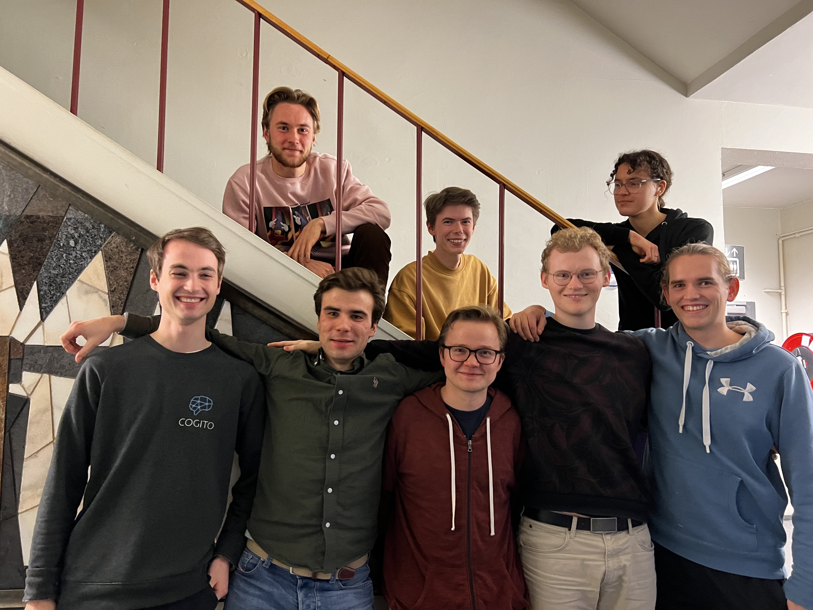

<a href="https://github.com/CogitoNTNU/README-template/blob/main/LICENSE" alt="LICENSE">
        </img></a>

<a href="" alt="platform">
        </img></a>
<a href="" alt="version">
        </img></a>

<h3 align="center">README-template</h3>
<!-- TABLE OF CONTENTS -->

  
Table of Contents

  <ol>
    <li>
      <a href="#about">About</a>
    </li>
    <li>
      <a href="#getting-started">Getting Started</a>
      <ul>
        <li><a href="#prerequisites">Prerequisites</a></li>
        <li><a href="#installation">Installation</a></li>
      </ul>
    </li>
    <li><a href="#usage">Usage</a></li>
   <li><a href="#team">Team</a></li>
    <li><a href="#license">License</a></li>
  </ol>

### About 
-----
We wanted to use artificial intelligence technologies to create a living painting that reacts to its environment. This was a rather complex task, so we split the problem into three sub-problems. Firstly, we wanted to use deepfakeing technology to transfer any face onto the subject of the painting. Secondly, we wanted to use style transfer technology to transform the style of the painting to our liking. Thirdly, we wanted to use computer vision technology to allow the painting to follow its spectators by turning its head. closing sentence. Combining the solutions of these sub-tasks would result in a painting that gives the impression of being truly alive.

### Getting started
------

#### Prerequisites
 * Python 3.8
 
#### Installation

`pip install -r requirements.txt`

https://akshay-jain.medium.com/pycharm-black-with-formatting-on-auto-save-4797972cf5de

### Groups
 * Application: Espen
 * Deep fakes: Martin, Magnus, Ann-Marie
 * Style transfer: Ulrik, Arild
 * Face detection: Didrik, Hans Jakob

------
<!--INSERT PICTURE OF TEAM-->

</img>

Right to left: [@example](https://github.com/Jonrodtang)    [@example](https://github.com/Jonrodtang)    [@example](https://github.com/Jonrodtang)    [@example](https://github.com/Jonrodtang)  
#### Leader(s):
- [Espen Boman Fosseide](https://github.com/espenbfo)
- [Martin Halleland](https://github.com/Halleland)

#### Team members:
- [Ann-Marie Revillard](https://github.com/oddfjell)
-  [Arild Strømsvåg](https://github.com/Arild-Sromsvag)

-  [Didrik Lindløv Sand](https://github.com/didrik1812)
-  [Hans Jakob Håland](https://github.com/hansjhaland)

- [Magnus Rasmussen](https://github.com/pMag)
- [Ulrik Røsby](https://github.com/ulrik2204)

### License
------
Distributed under the MIT License. See `LICENSE` for more information.

