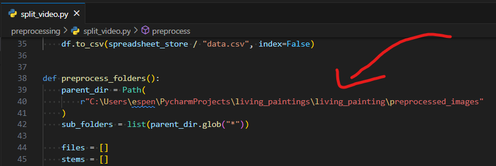

# Run project

## Prerequisites
### From scratch
To run the application one needs to have the video file of the person to style transfer.

One should make the background of the video file white. With treshold about 2

### With preprocessed images
1. Download the preprocessed images folder and make sure it is unpacked.
2. Alter the `parent_dir` variable in the function `preprocess_folders()` in `preprocessing/split_video_video.py` to the root preprocessed image folder.

3. To run the application, run the following command in the root folder of the project
```bash
python main.py
```


## Install 
```bash	
pip install -r requirements.txt
```

## Run
```bash
python main.py
```


